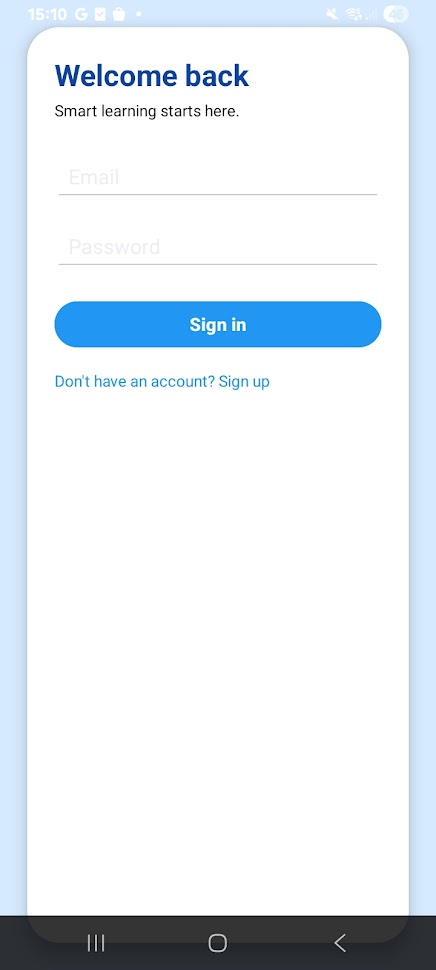
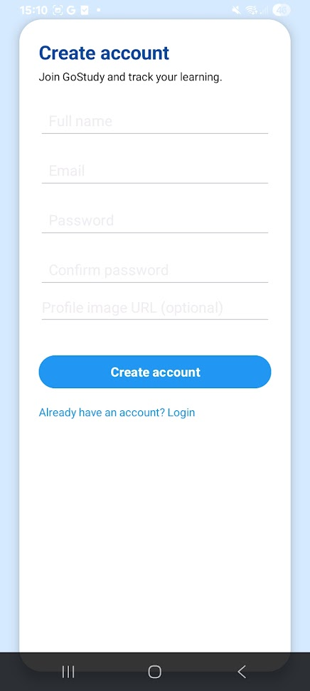
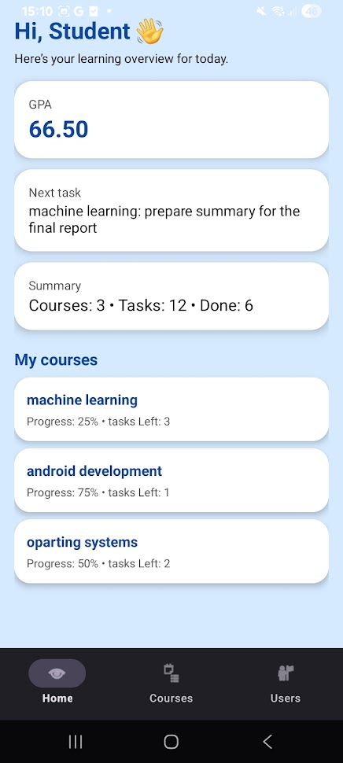
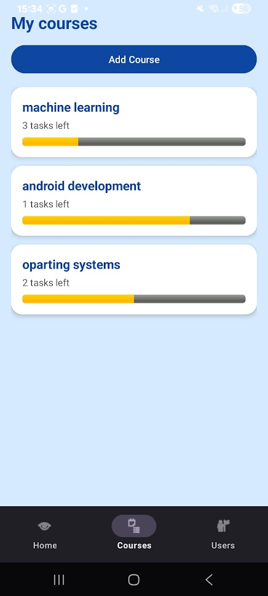
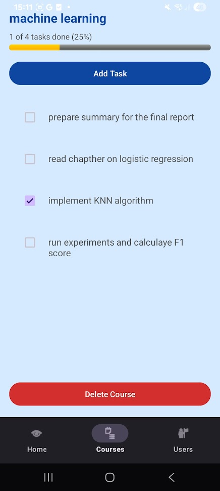
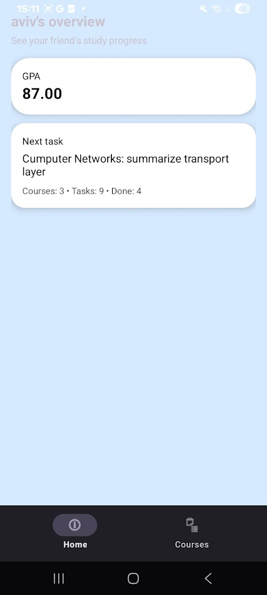
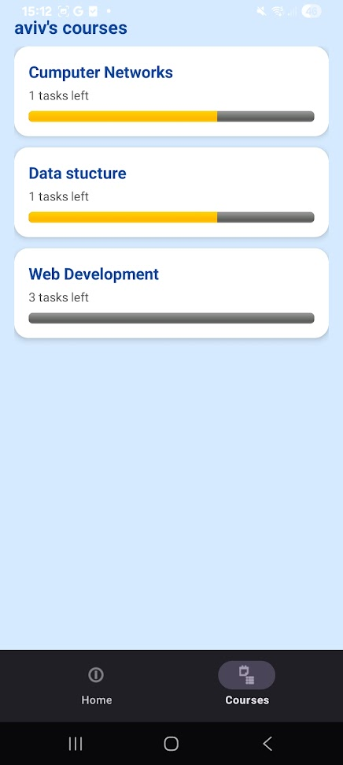

# GoStudy  


---

# Final Project — Mobile Applications Course  
*Afeka College of Engineering – Mobile Apps Course Final Project*

---

# How to Run (Installation & Setup)

1. Clone this repository:
   ```bash
   git clone https://github.com/<your-username>/GoStudy.git
   ```

2. Open the project in **Android Studio**

3. Add your Firebase config file into `/app/`:
   ```
   google-services.json
   ```

4. Enable the following in Firebase Console:
   - **Authentication → Email/Password**
   - **Cloud Firestore**

5. Sync Gradle  
6. Run the app on an emulator or a physical device

---

# Table of Contents

- [Overview](#overview)
- [Firebase Structure](#firebase-structure)
- [App Screens](#app-screens)
  - [Login & Signup](#login--signup)
  - [Home Screen](#home-screen)
  - [Courses Screen](#courses-screen)
  - [Course Details](#course-details)
  - [Users List](#users-list)
  - [User Profile — Home](#user-profile--home)
  - [User Profile — Courses](#user-profile--courses)
- [Planned but Not Implemented](#planned-but-not-implemented)
- [Future Improvements](#future-improvements)
- [Project Details](#project-details)
- [Author](#author)

---

# Overview

**GoStudy** is a mobile study-management application that helps students:

- Manage courses  
- Add tasks to each course  
- Track task completion  
- View automatic progress  
- Store personal GPA  
- View other users’ study profiles (read-only)  
- Sync all data with **Firebase Firestore**

The goal of the project is to provide a simple, clean, modern study planner with social features.

---

# Firebase Structure

### users/{uid}
```json
{
  "displayName": "Amit",
  "photoUrl": "https://...",
  "gpa": 87.5
}
```

### users/{uid}/courses/{courseId}
```json
{
  "name": "Operating Systems"
}
```

### users/{uid}/courses/{courseId}/tasks/{taskId}
```json
{
  "name": "Implement Thread Pool",
  "isDone": false
}
```

---

# App Screens

---

## Login & Signup
 | 


Users can:
- Sign up with name, email, password  
- Upload optional profile photo  
- Log in securely with Firebase Auth  

---

## Home Screen


Shows:
- GPA  
- Next upcoming task  
- Total tasks + completed  
- Clean UI  

---

## Courses Screen


Features:
- View all your courses  
- Each course displays:
  - Progress %
  - Tasks remaining  
- Tap a course → open details  

---

## Course Details


Inside each course:
- Add tasks  
- Mark tasks as done/undone  
- Progress bar updates automatically  
- **Delete course** (removes from Firestore)  

---

## Users List


Shows all registered users (except yourself):
- Profile image  
- Display name  
- Tap a user → open their public study profile  

---

## User Profile — Home


Read-only view of the selected user:
- GPA  
- Next task  
- Study statistics  

---

## User Profile — Courses


You can view:
- All the user’s courses  
- Progress for each  
- Tasks inside courses (read-only)  

---

# Future Improvements

Ideas for extending the project:

- Full dark mode theme  
- Better animations  
- Offline local caching  
- Custom avatars system  
- Import/export courses  
- GPA calculator tools  
- Study timer & focus mode  

---

# Project Details

| Category | Details |
|---------|---------|
| **Language** | Kotlin |
| **Platform** | Android |
| **Backend** | Firebase Firestore |
| **Authentication** | Firebase Auth |
| **UI** | XML + RecyclerView + CardView |
| **Images** | Glide |
| **Architecture** | Repository-based MVC |
| **Min SDK** | 24 |
| **Status** | Fully functional |

---

# Author

**Amit Halaly**  
Software Engineering Student  
Afeka College of Engineering  

Email: amithalaly1@gmail.com  
GitHub: https://github.com/<Amit-Halaly>

---

